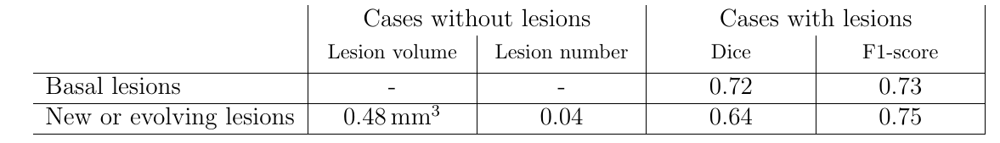
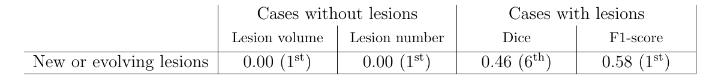

# Automatic detection of new or evolving lesions in Multiple Sclerosis

## Table of contents
<!-- TOC -->
* [Introduction](#introduction)
* [Results](#results)
  * [On the test split](#on-the-test-split)
  * [On the MSSEG-2](#on-the-msseg-2)
* [Using the docker image](#using-the-docker-image)
  * [Building the image](#building-the-image)
    * [With Docker](#with-docker)
    * [With Docker Compose](#with-docker-compose)
  * [Running the image](#running-the-image)
    * [With docker](#with-docker-1)
    * [With Docker Compose](#with-docker-compose-1)
* [Structure of the repository](#structure-of-the-repository)
<!-- TOC -->

## Introduction

This repository contains code for training Deep Learning models
for the automatic segmentation of both basal and new or evolving Multiple Sclerosis (MS) lesions.
The code is an adaptation of the [nnUNet](https://github.com/MIC-DKFZ/nnUNet) to our specific dataset.
The dataset is composed by longitudinal FLAIR MRI images of approximately 100 people treated at
the [Hospital Clínic de Barcelona (HCB)](https://www.clinicbarcelona.org/),
together with the target masks validated by professionals from the ImaginEM research team from the HCB.

The model generated can be accessed upon a fair request.

## Results

We here summarize the results of our model in both the test split and the MSSEG-2 dataset.
For the evaluation we have used the same metrics as in the MSSEG-2 challenge, 
namely:
+ The number of wrongly detected lesion voxels on cases without lesions.
+ The number of wrongly detected lesions on cases without lesions.
+ The voxel level Dice-score on cases with lesions.
+ The lesion level F1-score on cases with lesions.

### On the test split
The following table shows the evaluation metrics on the test split.

Plots from the qualitative analysis can be found in [this folder](nnUNet_test_results/Dataset100_MSSEG/nnUNetTrainerExtremeOversamplingEarlyStoppingLowLR__nnUNetPlans__3d_fullres/Analysis).

### On the MSSEG-2
The following table shows the evaluation metrics on the MSSEG-2 dataset, 
which only has labels for new or evolving lesions, 
together with the corresponding position in each ranking of the MSSEG-2 challenge.

Plots from the qualitative analysis can be found in [this folder](NEW_LESIONS_CHALLENGE/Analysis).
## Using the docker image

There are two ways of building and running the Docker image,
depending on whether you want to simply use the dockerfile
or you would rather use the compose file.
The only difference is that the docker-compose.yml file contains
the configuration that without it,
you will need to tell the docker CLI.
But of course for using the Compose you need to have the file at your current directory,
which may not be always ideal.

As you will see in the following commands,
you may need to run the image with privileges,
since it needs to access the GPU.

### Building the image

#### With Docker

Solely using Docker you can build the image with the following command:

> sudo docker build -t nnunetv2 -f deployment/Dockerfile .

#### With Docker Compose

Using Docker Compose you can build the image with the following command:

> sudo docker compose build nnunetv2

### Running the image

For running the images there are two things worth considering:

1. Your input data needs to be structured in a certain way.
   Concretely, your input images need to be inside a folder called "input"
   within the directory from which you are going to run the image,
   and their names need to match the pattern `{ID}_{TIMEPOINT}.nii.gz`,
   e.g. 013_0000.nii.gz and 013_0001.nii.gz.

2. Output segmentations will be stored in the "output" folder following the pattern `mask_{ID}.nii.gz`.

#### With docker

The command for running the image with solely Docker is the following,
which is also stored inside the `predict_wo_compose.sh` bash script:

> sudo docker run --gpus 1 --entrypoint=/bin/sh --rm
> -v "${PWD}"/input:/nnunet-ms-segmentation/input/
> -v "${PWD}"/output:/nnunet-ms-segmentation/output/
> nnunetv2 predict.sh

#### With Docker Compose

With Docker Compose you may run the image with the following command:

> sudo docker compose run --rm nnunetv2

## Structure of the repository

The structure of the repository is the following:

+ `custom_scripts`: contains most of the code used in this project,
  whose names are ordered alphabetically as they have been used.
    - `others`: contains some auxiliary scripts and instructions.
    - [A_config.py](custom_scripts/A_config.py): contains all the configuration variables and classes.
    - [B_convert_dataset.py](custom_scripts/B_convert_dataset.py): converts the IMAGINEM dataset as downloaded
      from the FTP server to the format required by nnU-Net v2.
    - [C_split.py](custom_scripts/C_split.py): performs the stratified train-test and CV train-val splits,
      and moves the test cases to the corresponding directory.
    - [C_quantitative_analysis.py](custom_scripts/C_quantitative_analysis.py): performs the exploratory
      quantitative analysis of the dataset.
    - [C_qualitative_analysis.ipynb](custom_scripts/C_qualitative_analysis.ipynb): performs the exploratory
      qualitative analysis of the dataset,
      displaying plots of the lesions in the dataset.
    - [D_full_nnunet_process.sh](custom_scripts/D_full_nnunet_process.sh): bash script that runs all the standard 
      nnU-Net CLI steps. 
      The preprocessing of the dataset required by nnU-Net was done using the corresponding command within this script, 
      and the choice of the best configuration is also done using the command in this script.
    - [D_train.py](custom_scripts/D_train.py): runs the nnU-Net Python API for model training. 
      Specially useful for debugging custom versions of nnU-Net.
    - [E_validate.py](custom_scripts/E_validate.py): runs the nnU-Net Python API for model validation.
    - [F_evaluate_quantitative.py](custom_scripts/F_evaluate_quantitative.py): performs the quantitative analysis
      of the performance of our ensemble of models.
    - [F_evaluate_qualitative.ipynb](custom_scripts/F_evaluate_qualitative.ipynb): performs the qualitative
      analysis of the performance of our ensemble of models.
    - [plotting.py](custom_scripts/plotting.py): contains the plotting utilities.
    - [utils.py](custom_scripts/utils.py): contains the generic utilities.
+ `data`: data directory expected by nnU-Net, where the raw and preprocessed data is stored.
+ `deployment`: contains the files and scripts for the deployment of the model as a Docker container, 
  except for the [docker-compose.yml](docker-compose.yml) that can be found at the root.
+ `documentation`: directory with nnU-Net documentation markdown files.
+ `NEW_LESIONS_CHALLENGE`: directory where the MSSEG-2 and MS Open Data datasets are stored,
  together with the predictions and results of the evaluation.
  It is important that within the code in this repository
  these two datasets combined are referred to as the "msseg2" dataset.
  Cases from the MS Open Data dataset can be identified by their id,
  that contains the string "patient".
+ `NEW_LESIONS_IMAGINEM`: directory where the ImaginEM dataset is first stored,
  and where the `B_conver_dataset.py` script expects to find it.
+ `nnUNet_results/Dataset100_MSSEG`: directory with the results of nnU-Net trainings. Each folder is a specific training
  configuration.
+ `nnUNet_test_results/Dataset100_MSSEG`: directory with the test results of nnU-Net trainings. Each folder is a
  specific training configuration.
+ `nnunetv2`: contains the nnU-Net v2 source code, together with the trainer we have customized for our implementation.
  These trainers can be found in the [nnUNetTrainerCustom.py](nnunetv2/training/nnUNetTrainer/variants/0_OURS/nnUNetTrainerCustom.py) script.
